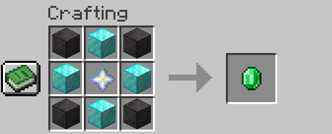

# Crafting


The following are the defaults, which can be changed by server owners. For more info on how to change it, see [configuration](../../fundamentals/getting-set-up/configuration/ "mention")for more details.


## Crafting A New Gem

Follow the recipe below

<figure><figcaption>
New Gem Recipe
</figcaption></figure>

## Upgrading Gems

Follow the recipe below, which is universal for all gems. Can be changed by level in [configuration](../../fundamentals/getting-set-up/configuration/ "mention")

<figure><figcaption>
Gem Upgrade Recipe
</figcaption></figure>
